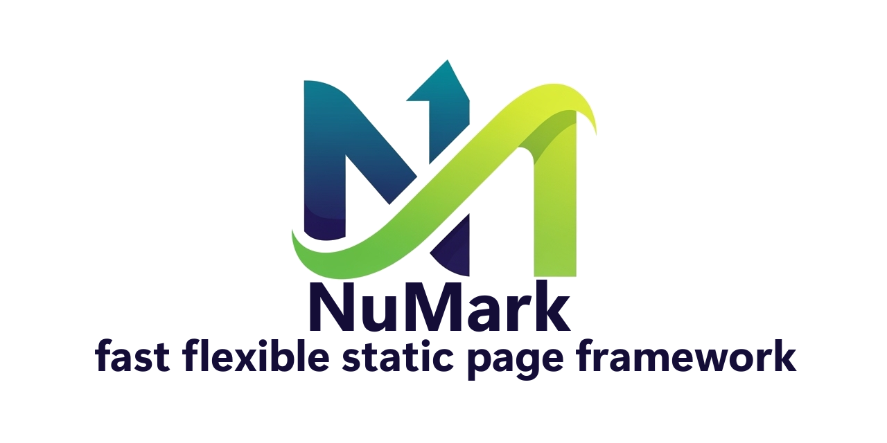

# NuMark

<div align="center">
  

nextgen static page framework that parses Markdown files into lightning-fast, highly customizable websites.

[](https://github.com/numark/numark)


• 


[](https://nodejs.org)
[](https://www.npmjs.com/)

[Getting Started](#getting-started) | [Contribute](CONTRIBUTING) | [Documentation](https://github.com/numark-dev/NuMark/wiki) | [Website](https://numark-dev.github.io/NuMark/) | [License](#license)
</div>

## Getting started

### Cloning the repository

```bash
  git clone https://github.com/numark-dev/NuMark.git
  cd NuMark
```

### Install dependencies

```bash
  npm install
```

### Run framework
```bash
  npm run dev
```

### **Stay Updated**
- ⭐ **Star this repo** to stay updated with new releases
- 👀 **Watch releases** to get notified of new versions
- 🐦 **Follow updates** on our x channel

[](https://x.com/NuMark_dev)

## License

This project is licensed under the [AGPL v3.0 License](LICENSE).

---

<div align="center">

Built with ❤️ by

[](https://github.com/kenTHiC)

</div>
